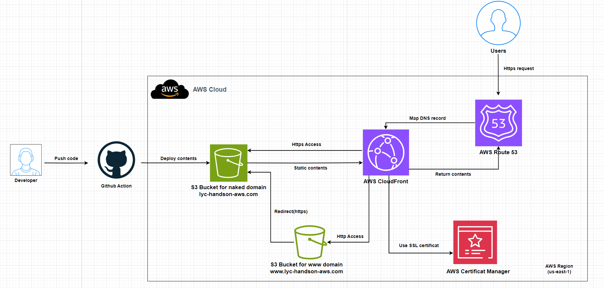

# Topic 4 - Docker image build's CI/CD, push to private DTR(Codebuild+ECR)
##  Yuanchao Hands-on Project

## This readme is more readable [here](https://github.com/lyc-handson-aws/handson-topic4)

## **Overview** 

**Project's main features**

:point_right:  A private docker trusted registry(DTR)

:point_right:  A  GitHub repo that contains a docker image(redmine) definition(Dockerfile) to build

:point_right: A CI/CD job for building this specific docker image and then pushing to this specific DTR

## What could be learned in this topic:

1. How to create an ECR repository
2. How to use SecretsManager to store a secret and reference this secret in a CloudFormation stack
3. How to use/configure a CodeBuild project, including configuring the build environment, trigger conditions, sources, and logging
4. How to write a CodeBuild CI file: buildspec.yaml, especially in which how to push an image to an existing ECR

## **Architecture**

the diagram below illustrates the architecture(principle) of this project:

Amazon Elastic Container Registry

## Continue Deployment

CloudFormation stack's deployment: see GitHub workflows https://github.com/lyc-handson-aws/handson-topic4/blob/master/.github/workflows/action-cf.yaml

Docker image's build and push to DRT: see Codebuild spec https://github.com/lyc-handson-aws/handson-topic4/blob/master/buildspec.yml

## **CloudFormation Stack Quick-create Link**

Click here to quickly create a same project with the same AWS resources:  [here](https://eu-west-3.console.aws.amazon.com/cloudformation/home?region=eu-west-3#/stacks/create/review?templateURL=https://s3bucket-handson-topic1.s3.eu-west-3.amazonaws.com/CF-template-handson-topic4.yaml)

**See Stack's description for complete actions to reproduce the same project**

> the default stack's region "Europe (Paris) eu-west-3"

## **AWS Resources**

Project's AWS resources:

:point_right: AWS::ECR::Repository

:point_right: AWS::SecretsManager::Secret

- a secret that store the github personal token

:point_right: AWS::IAM::Role

- Grant a role relatives permissions (as AWS Codebuild service)to interact with other AWS resources: AWS Cloudwatch(log)/AWS Secret manager/Amazon ECR...

:point_right: AWS::CodeBuild::Project

- Private Project with no artifact
- Define environment type used for Build runtime
- Define environment vars including DTR Repo name(ECR)  
- Bind the IAM role

- Define the source Github repo and buildspec.yaml's location and trigger way/condition

- Enable the log group's automatic creation

- AWS::CodeBuild::SourceCredential - Define the credential for accessing target source

  
